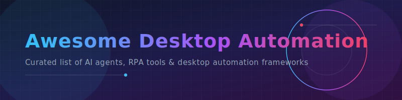

  

# 🚀 Awesome Desktop Automation - Curated List of AI Computer-Use Agents, RPA Tools & Desktop Automation Startups

  

## 🌟 Top Robotic Process Automation (RPA) & AI Desktop Agent Ecosystem

**Curated List of SaaS Products & Open-Source GitHub Projects**  
*Focused on AI-Powered Desktop Automation, Robotic Process Automation (RPA) & Agentic Workflows*  
**Last updated: March 2026**

This repository tracks notable **SaaS platforms** and **open-source projects** building **Desktop Automation Startups**. These tools use AI computer-use agents to automate repetitive desktop tasks, browser actions, file operations, app interactions, and workflow orchestration across local machines (Windows, macOS, and Linux).

**Examples** include Cyberdesk, Minicor, Coasty, RamAIn, Sola, and Pig (the category leaders). Tools listed here emphasize **agentic capabilities** (multi-step reasoning, visual understanding, GUI interaction, and cross-application automation).

**Open-source emphasis**: This section is heavily expanded with every major active project for self-hosting, local Large Language Models (LLMs like Ollama, Llama 3), full customization, and complete data privacy — ideal for developers and power users who want sovereign desktop automation.

Contributions welcome! Open a PR to add/update entries. Keep descriptions factual and link to official sites.

## 📋 Table of Contents
- [SaaS Products](#saas-products)
- [Open-Source GitHub Projects](#open-source-github-projects)
- [How to Contribute](#how-to-contribute)
- [Disclaimer](#disclaimer)

## 💼 SaaS Products

### 🤖 Core Platforms (Desktop Automation Startups)

| Product | Description | Pricing | Free Tier Limit | Company Size (Funding/Valuation) |
| :--- | :--- | :--- | :--- | :--- |
| **[Sola](https://sola.ai/)** | Desktop-focused AI agent for personal and professional workflow automation. | $49/mo (Starter), $199/mo (Pro) | 20 AI credits/week, 2 team members, 2 data sources | $21.5M Funding |
| **[Cyberdesk](https://cyberdesk.ai/)** | AI agent platform for automating complex desktop workflows and application interactions. | Custom / Developer pricing | GitHub starter kits & developer access | $500K Funding / $220K ARR |
| **[Minicor](https://minicor.ai/)** | Intelligent desktop automation tool focused on repetitive task elimination with AI. | Usage-based (B2B focus) | None (Demo/custom inquiry required) | $500K Funding |
| **[RamAIn](https://ramain.ai/)** | AI-powered automation platform specializing in desktop and browser task orchestration. | Starts at $25/mo (Professional), $500+/mo (Enterprise) | Free Plan ($0/mo) with 1 concurrent run & webhooks | $500K Funding |
| **[Pig](https://pig.ai/)** | Innovative AI desktop automation startup with strong GUI understanding capabilities. | Estimated $20–$40/mo | Contact sales for trial / limits | $500K Funding |
| **[Coasty](https://coasty.ai/)** | Modern AI desktop agent for cross-application automation and productivity enhancement. | Starts at $19/mo (Starter), $50/mo (Plus), $99/mo (Unlimited) | Rate-limited starter plan (no credit card required) | $500K Funding |

### ⚙️ Advanced & Specialized Platforms

**Other notable mentions**: UiPath, Automation Anywhere, and various RPA platforms with AI features.

## 💻 Open-Source GitHub Projects

### 🛠️ Dedicated Desktop Automation Tools

- **[n8n](https://github.com/n8n-io/n8n)**   
  Open-source workflow automation with nodes for desktop and browser automation.

- **[Huginn](https://github.com/huginn/huginn)**   
  Open-source personal automation agent for desktop and web task orchestration.

- **[Aider](https://github.com/paul-gauthier/aider)**   
  Command-line AI coding assistant that works directly with local codebases and desktop tools.

- **[LangGraph Desktop Agents](https://github.com/langchain-ai/langgraph)**   
  Stateful multi-agent framework for building reliable desktop automation agents.

- **[Continue](https://github.com/continuedev/continue)**   
  Open-source autopilot for VS Code and JetBrains with desktop automation capabilities.

- **[CrewAI Desktop Crews](https://github.com/crewAIInc/crewAI)**   
  Role-based multi-agent orchestration for complex desktop workflows.

- **[OpenDevin](https://github.com/OpenDevin/OpenDevin)**   
  Open-source autonomous AI software engineer capable of interacting with desktop environments and performing complex tasks.

- **[PyAutoGUI](https://github.com/asweigart/pyautogui)**   
  Popular open-source library for GUI automation and desktop task scripting.

- **[RoboBrowser](https://github.com/RoboBrowser/robobrowser)**   
  Python library for browser automation that can be combined with desktop control.

- **[SikuliX](https://github.com/RaiMan/SikuliX1)**   
  Open-source visual automation tool that uses image recognition to control desktop applications.

### ➕ Additional Strong Open-Source Options

- **[AutoHotkey](https://github.com/AutoHotkey/AutoHotkey)**  — Classic Windows automation scripting language with AI extensions.
- **[Appium](https://github.com/appium/appium)**  — Open-source mobile/desktop automation framework.
- **[Robot Framework](https://github.com/robotframework/robotframework)**  — Keyword-driven test automation with desktop support.
- **[TagUI](https://github.com/kelaberetiv/TagUI)**  — Free RPA tool for desktop and web automation.
- **[UI.Vision](https://github.com/A9T9/RPA)**  — Open-source RPA tool with visual automation.
- Many community **Ollama + PyAutoGUI** stacks for intelligent desktop agents.

**Frameworks for building custom agents**: Combine **OpenDevin**, **Aider**, **PyAutoGUI**, and **LangGraph** with **Ollama** to create fully local, powerful desktop automation agents.

## 🤝 How to Contribute

1. Fork the repo.
2. Add/edit entries in `README.md` (follow existing format).
3. Include: name, link, 1–2 sentence description, and whether it's SaaS or open-source.
4. Submit PR with a short explanation.

Star the repo if you find it useful!

## ⚠️ Disclaimer

- This is a **community-curated** list — not exhaustive and not an endorsement.
- Desktop automation tools can interact with sensitive applications — use responsibly and securely.
- Self-hosted open-source solutions require proper configuration and testing.

---

**Made for power users, developers, automation enthusiasts, and productivity hackers.**  
Let's make desktop automation more intelligent, private, and fully controllable.
